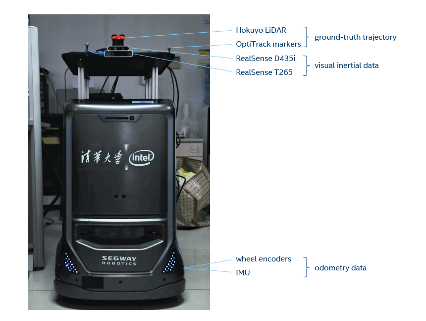

[toc]

# SLAM data recording

## 1.euroc数据集 

EuRoC MAV Dataset包含多种视觉惯性数据集合,通过微型航空飞行器在线采集.该数据集包含双目\同步IMU测量数据,精确的移动和结构真值.

- 可以获取的数据:

  视觉惯性传感器

  双目图片(Aptina MT9V034 global shutter, WVGA monochrome, 2×20 FPS)

  MEMS IMU (ADIS16488  200HZ)

  双目中心快门时间对准

- groundtruth

  **Vicon** motion capture system (6D pose)

  **Leica MS50** laser tracker (3D position)

  Leica MS50 3D structure scan

- 标定数据

   Camera intrinsics

   Camera-IMU extrinsics

   Spatio-temporally aligned ground-truth

  

## 2.Kitti数据集

## 3. TUM数据集

## 4. OpenLORIS-Scene数据集

[OpenLORIS-Scenedata](https://lifelong-robotic-vision.github.io/dataset/scene.html)

OpenLORIS-Scene dataset目的是帮助评估真实世界部署后SLAM的成熟性和场景的理解能力,通过提供真实场景中机器人记录的视觉\惯性和里程计数据 ,并且提供通过运动捕捉系统或高分辨率雷达获取的机器人轨迹真值.为每种场景提供多种轨迹,变换场景包括人们的活动,白天黑夜的变化和其他因素等,这些对长期自主运行的机器人是非常关键的.

使用OpenLORIS-Scene,我们为SLAM提供了基准.

机器人和传感器

数据的采集依赖不高于人类步行速度的轮式机器人.主要的传感器包括一个 RealSense D345i相机和 一个RealSenseT265相机,位于一米左右的固定位置.D345i采集的彩色图深度图推荐使用单独算法或RGBD算法处理.而T265采集的双目fisheye图像推荐使用双目算法.两者都提供了与图像硬件同步的IMU测量值.轮速编码器里程计数据也提供.

真值

对于办公室场景的机器人真实值轨迹通过OptiTrack运动捕捉系统获取.对于其他场景则是依据Hokuyo激光扫描仪的离线LiDAR SLAM获得.
